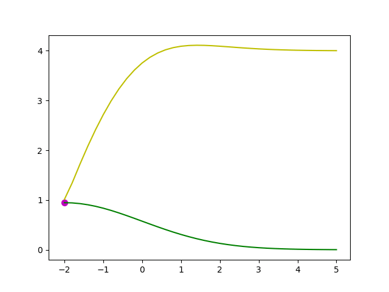

# Hyperprameter Optimization Library using GP, GMRF

<!---
[](https://travis-ci.org/LittleWat/gp_ycb_python_lib)
-->

## Install
Only Python 3.x is supported.

Please install [suite-sparse](http://faculty.cse.tamu.edu/davis/suitesparse.html) (necessary for efficient computation). 
If you use Mac, execute this command.
```bash
brew install suite-sparse

pip install scikit-sparse
```
Then install this library.
```bash
pip install -e .
```

## Usage
### Demo
##### 1. Move to one sample dir

```bash
cd ./samples/one_dim_test
```
##### 2. Generate the searching paramter files
```bash
cd ./param_dir

python generate_1dim_param_file.py
```
This generates 'csv_files' dir.

| x     | bo_x  | 
|-------|-------| 
| -5.0  | -5.0  | 
| -4.75 | -4.75 | 
| -4.5  | -4.5  | 
| -4.25 | -4.25 | 
| ...   | ...   | 

'x' parameter is for your machine learning algorithm.

'bo_x' paramter is for baysian optimization (GP or GMRF).


##### 3. Run the script
```bash
cd ../

python test1.py
```

This generates 'output' dir.

'output' dir contains 'gaussian_result_1dim.csv' as follows

| bo_x  | x     | n_exp | output         | 
|-------|-------|-------|----------------| 
| 0.0   | 0.0   | 1     | 0.266460796864 | 
| 0.25  | 0.25  | 1     | 0.262676939115 | 
| -2.5  | -2.5  | 1     | 0.476519303216 | 
| -2.25 | -2.25 | 1     | 0.407687447961 | 
| ...   | ...   | ...   | ...            | 


When 'n_exp' column is 1, 'output' column denotes the real value.


However, when you use CTR simulation sample such as 'one_dim_test_many_click_val',
this generates 'gaussian_result_1dim_click.csv' as follows


| bo_x  | x     | n_exp  | output | 
|-------|-------|--------|--------| 
| -2.5  | -2.5  | 100000 | 43271  | 
| -2.25 | -2.25 | 100000 | 34749  | 
| 2.5   | 2.5   | 100000 | 46154  | 
| 2.75  | 2.75  | 100000 | 55212  | 
| ...   | ...   | ...    | ...    | 

This 'n_exp' column is larger than 1.
When 'n_exp' column is larger than 1, 'output' column denotes the nuber of click.


Please be careful of this because 'output' column meaning depends on the 'n_exp' column value.
This is controlled by 'env.py'.

### Your ML hyper-paramter tuning
1. Copy the sample directory (ex. samples/svm ). 

(sample/lda needs to be fixed so do not use sample/lda (2017/9/7)) 

2. Edit 4 ~ 6 files in your copied directory. ("HOGE" should be set to your model name.)

    1. param_dir/generate_HOGE_param_file.py (You don't necessarily use this script.)
    
        This file generate hyper-paramtere sets. 
        
    2. cmdline_HOGE.txt
    
        This file is a cmd-line script that calls your machine learning programs that contains hyper-parameter.
        
        If you need a config file that contains hyper-paramter to call your program, the config file sould be set "$param_file"
        
    3. parameter_HOGE.json (Optional, but maybe useful to use in "get_result" function of "myenv.py")
    
        This file is used to kick your program. Also, you should set a paramter in order to get the result of your program (ex. "filename_result": "./libsvm/output/accuracy_$model_number.txt").
        
        "$model_number" is optional. If you would like to save your model every bandit process, you should use this.
        
    4. parameter_gp.json
    
        This file is used to set paramers of Gaussian Process.
        
    5. myenv.py
    
        You have to implement "get_result" function.

        ```python
        from gphypo.env import Cmdline_Environment
        
        
        class MyEnvironment(Cmdline_Environment):
            def get_result(self):
                
                ### WRITE BELOW ###
                
                
                res = GET_YOUR_PROGRAMS_OUTPUT
                ################
                
                return res
        ```

     6. run.sh (Optional)
        You have to call "run.py" here.
        

#### Hyperparamter tuning (GP) demo
GP kernel was set below

```python
from sklearn.gaussian_process.kernels import RBF, WhiteKernel, ConstantKernel as C

C(1, constant_value_bounds="fixed") * RBF(2, length_scale_bounds="fixed") + WhiteKernel(1e-1)
```

- Yellow mesh means the predicted UCB score.
- Green mesh means the predicted mean score.
- Blue mesh means the ground-truth (gt) score.

 
##### gaussian optimization


##### libsvm optimization
Train and test dataset is the same iris dataset. (not good)

Dataset for libsvm can be downloaded from [here](https://www.csie.ntu.edu.tw/~cjlin/libsvmtools/datasets/multiclass.html)



##### lda optimization


